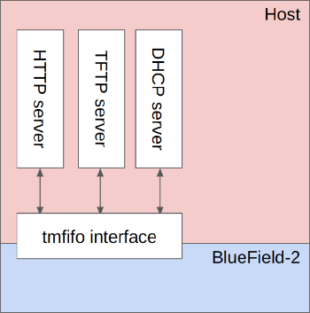

# Installing RHEL on BlueField-2
Welcome to this guide on installing Red Hat Enterprise Linux (RHEL) on the NVIDIA BlueField-2 Data Processing Unit (DPU). The BlueField-2 combines the capabilities of a Network Interface Card (NIC) with a general-purpose CPU, making it a versatile platform for running various applications. This article will guide you through the process of setting up RHEL on the BlueField-2 using the rshim interface and a PXE server on the host machine. Note that it requires to run specific steps at the right time. 
# Overview of the Setup

When it comes to installing RHEL on the BlueField-2, a PXE server can be set up either on the network or on the host machine itself. The advantage of choosing the latter option is that you won't need to configure your network in any specific way. This self-contained approach simplifies the setup process, making it more accessible and user-friendly. The diagram below shows the setup.



Ingredients of the setup:

- RHEL installation on x86 host with rshim package
- RHEL iso (download this through your Red Hat subscription)
- Custom GRUB configuration
- Custom kickstart configuration
- TFTP server
- DHCP server
- HTTP server

# Step by step walk-through

The remainder of this article focuses on setting up all these components and booting the BlueField-2 into RHEL. Start by ensuring that the BlueField-2 is detected on the x86 host by issuing the following command:

```bash
lspci | grep -i blue
```

Next, download the RHEL iso from your RH subscription. Note that you need the AARCH version of the RHEL iso since the BlueField-2 uses the ARM architecture. Mount the iso:


```bash
mount -t iso9660 -o loop ISO_NAME ISO_PATH
```

Create a tftp boot directory an copy the necessary files:

```bash
mkdir /var/lib/tftpboot/
mkdir /var/lib/tftpboot/pxelinux
cp $ISO_PATH/images/pxeboot/vmlinuz /var/lib/tftpboot/pxelinux
cp $ISO_PATH/images/pxeboot/initrd.img /var/lib/tftpboot/pxelinux
```

Create a custom GRUB configuration at `/var/lib/tftpboot/grub.cfg` where 172.131.100.1 is the IP that will be set up later on the tmfifo interface later:

```bash
set timeout=5

menuentry 'Install' --class red --class gnu-linux --class gnu --class os {{
    linux pxelinux/vmlinuz showopts inst.repo=http://172.131.100.1/mnt inst.ks=http://172.131.100.1/kickstart.ks \
        console=tty0 console=tty1 console=ttyS0,115200 console=ttyS1,115200 \
        ip=dhcp console=ttyAMA1 console=hvc0 console=ttyAMA0 earlycon=pl011,0x01000000
    initrd pxelinux/initrd.img 
}}

menuentry 'Reboot' --class red --class gnu-linux --class gnu --class os {{
    reboot
}}
```

Create a custom DHCP server configuration at `/etc/dhcp/dhcpd.conf`. Do not forget to insert your DNS servers and domain:


```bash
option space pxelinux;
option pxelinux.magic code 208 = string;
option pxelinux.configfile code 209 = text;
option pxelinux.pathprefix code 210 = text;
option pxelinux.reboottime code 211 = unsigned integer 32;
option architecture-type code 93 = unsigned integer 16;
allow booting;
allow bootp;

next-server 172.131.100.1;
always-broadcast on;

filename "/BOOTAA64.EFI";

subnet 172.131.100.0 netmask 255.255.255.0 {{
    range 172.31.100.10 172.31.100.20;
    option broadcast-address 172.31.100.255;
    option routers 172.131.100.1;
    option domain-name-servers <INSERT COMMA SEPARATED LIST OF DNS SERVERS HERE>;
    option domain-search "<INSERT DOMAIN HERE>";
    option dhcp-client-identifier = option dhcp-client-identifier;
}}
```


Prepare the files for HTTP:

```bash
cp $ISO_PATH/images/pxeboot/rootfs.img /www
```

Create a kickstart file at `/www/kickstart.ks`

```bash
# System language
lang en_US.UTF-8

# Use text mode install
text

# Keyboard layouts
keyboard us

# Use network installation
url --url="REPO_URL"

# Accept the license
eula --agreed

# System timezone
timezone --utc Asia/Jerusalem

# Root password
rootpw bluefield

# Disable firewall
firewall --disabled

# System authorization information
auth --enableshadow --passalgo=sha512

# Do not configure the X Window System
skipx

# Disable the Setup Agent on first boot
firstboot --disabled

# Network information
network --bootproto=dhcp --hostname=bluefield-soc.mlx --device=eth0 --activate

# Bootloader/partition configuration
ignoredisk --only-use=mmcblk0
clearpart --all --initlabel --drives=mmcblk0
autopart --type=plain
bootloader --append="crashkernel=auto console=ttyAMA1 console=hvc0 console=ttyAMA0 earlycon=pl011,0x01000000 earlycon=pl011,0x01800000" --location=mbr --boot-drive=mmcblk0

# Reboot after installation
reboot

%packages --ignoremissing
@base
@core
@Development Tools
python3-devel
atk
cairo
tcl
tk
nfs-utils
chrony
vim
ethtool
git
grubby
xterm
NetworkManager-config-server
%end

%post --interpreter /bin/bash
systemctl set-default multi-user.target
systemctl disable initial-setup-graphical.service

# Necessary for accessing virtual console via rshim
systemctl enable serial-getty@hvc0
systemctl start serial-getty@hvc0

systemctl enable serial-getty@ttyAMA0.service
systemctl start serial-getty@ttyAMA0.service

systemctl enable serial-getty@ttyAMA1.service
systemctl start serial-getty@ttyAMA1.service

systemctl disable firewalld

dnf update

systemctl stop chronyd.service
chronyd -q 'server clock.redhat.com iburst'
hwclock --systohc --localtime

%end
```

Next, reboot the BF, wait 5 seconds, add an IP on the tmfifo interface and connect to the console through minicom to interrupt the boot process. 


```bash
echo SW_RESET 1 > /dev/rshim0/misc
sleep 5
ip a a 172.131.100.1/24 dev tmfifo_net0
minicom --color on --baudrate 115200 --device /dev/rshim0/console
```

Once interrupted, start the tftp server and the http server:


```bash
/usr/sbin/in.tftpd -s -L /var/lib/tftpboot
cd /www; python -m http.server 
```

On the console, select the option to boot from the interface that has a mac address that starts with 001ACAFFFF. RHEL should boot and the installation should proceed automatically.

# Conclusion
If all went well, the BlueField-2 will reboot into the the fresh RHEL environement after the installation completes. Since multiple steps require to be executed at specific times, the automated version of the steps is available as the pxeboot script at https://github.com/bn222/bluefield-2-tools/blob/main/pxeboot. That script is packaged into a container that is publicly available at https://quay.io/bnemeth/bf.
